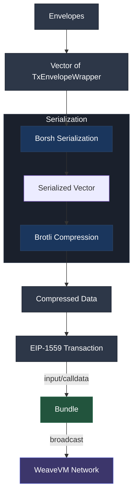
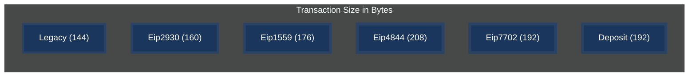
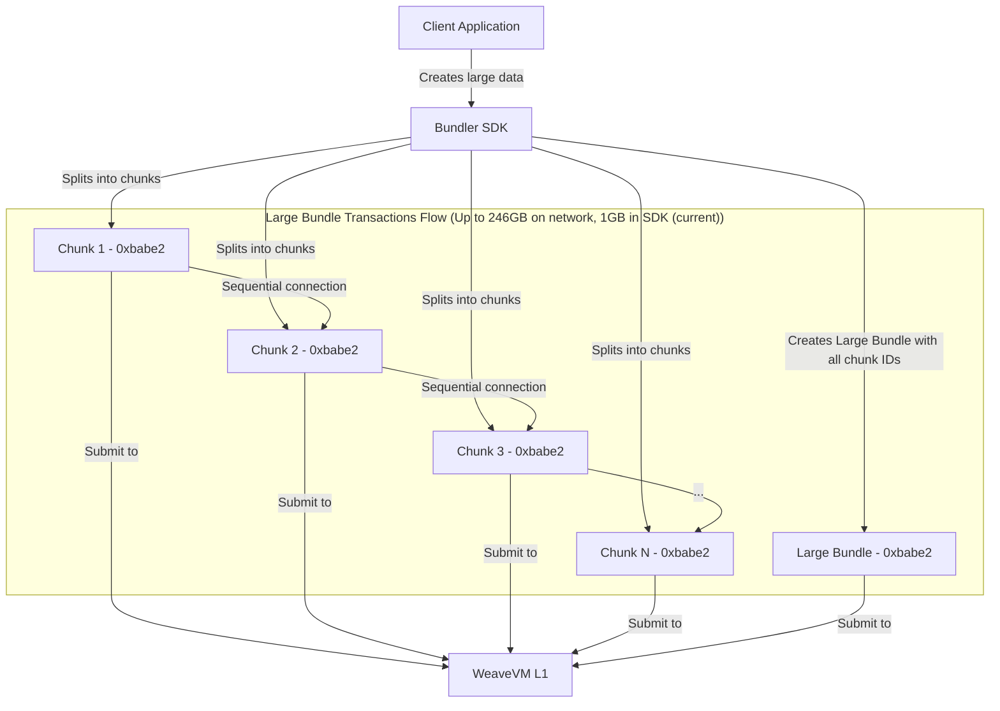

<p align="center">
  <a href="https://wvm.dev">
    
  </a>
</p>

## About

WeaveVM Bundler is a data protocol specification and library that introduces the first bundled EVM transactions format. This protocol draws inspiration from Arweave's [ANS-102](https://github.com/ArweaveTeam/arweave-standards/blob/master/ans/ANS-102.md) specification.

***Bundler as data protocol and library is still in PoC (Proof of Concept) phase - not recommended for production usage, testing purposes only.***

### Advantages of WeaveVM bundled transactions

* Reduces transaction overhead fees from multiple fees (`n`) per `n` transaction to a single fee per bundle of envelopes (`n` transactions)
* Enables third-party services to handle bundle settlement on WeaveVM
* Maximizes the TPS capacity of WeaveVM network without requiring additional protocol changes or constraints
* Supports relational data grouping by combining multiple related transactions into a single bundle

## Protocol Specification

### Nomenclature
- **Bundler**: Refers to the data protocol specification of the EVM bundled transactions on WeaveVM.
- **Envelope**: A legacy EVM transaction that serves as the fundamental building block and composition unit of a Bundle.
- **Bundle**: An EIP-1559 transaction that groups multiple envelopes (`n > 0`), enabling efficient transaction batching and processing.
- **Large Bundle**: A transaction that carries multiple bundles.
- **Bundler Lib**: Refers to the Bundler Rust library that facilitates composing and propagating Bundler's bundles.

### 1. Bundle Format

A bundle is a group of envelopes organized through the following process:

1. Envelopes MUST be grouped in a vector
2. The bundle is Borsh serialized according to the `BundleData` type
3. The resulting serialization vector is compressed using Brotli compression
4. The Borsh-Brotli serialized-compressed vector is added as `input` (calldata) to an EIP-1559 transaction
5. The resulting bundle is broadcasted on WeaveVM with `target` set to `0xbabe1` address ([`0xbabe1d25501157043c7b4ea7CBC877B9B4D8A057`](https://explorer.wvm.dev/address/0xbabe1d25501157043c7b4ea7CBC877B9B4D8A057))

```rust
pub struct BundleData {
    pub envelopes: Vec<TxEnvelopeWrapper>,
}
``` 



### Bundles Versioning

Bundles versioning is based on the bundles target address:

| Bundle Version  | Bundler Target Acronym | Bundler Target Address |
| :-------------: |:-------------:| :-------------:|
| v0.1.0      | `0xbabe1`     | [0xbabe1d25501157043c7b4ea7CBC877B9B4D8A057](https://explorer.wvm.dev/address/0xbabe1d25501157043c7b4ea7CBC877B9B4D8A057)| 
| v0.2.0      | `0xbabe2`     | [0xbabe2dCAf248F2F1214dF2a471D77bC849a2Ce84](https://explorer.wvm.dev/address/0xbabe2dCAf248F2F1214dF2a471D77bC849a2Ce84)| 

### 2. Envelope Format

An envelope is a signed Legacy EVM transaction with the following MUSTs and restrictions.

```rs
pub struct Tag {
    pub name: String,
    pub value: String,
}

pub struct EnvelopeSignature {
    pub y_parity: bool,
    pub r: String,
    pub s: String,
}

pub struct TxEnvelopeWrapper {
    pub chain_id: u64,
    pub nonce: u64,
    pub gas_price: u128,
    pub gas_limit: u64,
    pub to: String,
    pub value: String,
    pub input: String,
    pub hash: String,
    pub signature: EnvelopeSignature,
    pub tags: Option<Vec<Tag>>,
}
```

1. **Transaction Fields**
   * `nonce`: MUST be 0
   * `gas_limit`: MUST be 0
   * `gas_price`: MUST be 0
   * `value`: MUST be 0

2. **Size Restrictions**
   * Total Borsh-Brotli compressed envelopes (Bundle data) MUST be under 9 MB
   * Total Tags bytes size must be <= 2048 bytes before compression.

3. **Signature Requirements**
   * each envelope MUST have a valid signature

4. **Usage Constraints**
   * MUST be used strictly for data settling on WeaveVM 
   * MUST only contain envelope's calldata, with optional `target` setting (default fallback to ZERO address)
   * CANNOT be used for:
     - tWVM transfers
     - Contract interactions
     - Any purpose other than data settling


### 3. Transaction Type Choice
The selection of transaction types follows clear efficiency principles. Legacy transactions were chosen for envelopes due to their minimal size (144 bytes), making them the most space-efficient option for data storage. EIP-1559 transactions were adopted for bundles as the widely accepted standard for transaction processing.



### 4. Notes
* Envelopes exist as signed Legacy transactions within bundles but operate under distinct processing rules - they are not individually processed by the WeaveVM network as transactions, despite having the structure of a Legacy transaction (signed data with a Transaction type). Instead, they are bundled together and processed as a single onchain transaction (therefore the advantage of Bundler).

* Multiple instances of the same envelope within a bundle are permissible and do not invalidate either the bundle or the envelopes themselves. These duplicate instances are treated as copies sharing the same timestamp when found in a single bundle. When appearing across different bundles, they are considered distinct instances with their respective bundle timestamps (valid envelopes and considered as copies of distinct timestamps).

* Since envelopes are implemented as signed Legacy transactions, they are strictly reserved for data settling purposes. Their use for any other purpose is explicitly prohibited for the envelope's signer security.

## Large Bundle

### About

A Large Bundle is a bundle under version 0xbabe2 that exceeds the WeaveVM L1 and `0xbabe1` transaction size limits, introducing incredibly high size efficiency to data settling on WeaveVM. For example, with [Alphanet v0.4.0](https://blog.wvm.dev/alphanet-v4) running @ 500 mgas/s, a Large Bundle has a max size of 246 GB. For the sake of DevX and simplicity of the current 0xbabe2 stack, Large Bundles in the Bundler SDK have been limited to 1GB, while on the network level, the size is 246GB.

### Architecture design

Large Bundles are built on top of the Bundler data specification. In simple terms, a Large Bundle consists of `n` smaller chunks (standalone bundles) that are sequentially connected tail-to-head and then at the end the Large Bundle is a reference to all the sequentially related chunks, packing all of the chunks IDs in a single `0xbabe2` bundle and sending it to WeaveVM.


### Large Bundle Size Calculation

#### Determining Number of Chunks

To store a file of size S (in MB) with a chunk size C, the number of chunks (N) is calculated as:

**N = ⌊S/C⌋ + [(S mod C) > 0]**

Special case: **if S < C then N = 1**

#### Maximum Theoretical Size

The bundling actor collects all hash receipts of the chunks, orders them in a list, and uploads this list as a WeaveVM L1 transaction. The size components of a Large Bundle are:

- 2 Brackets [ ] = 2 bytes
- EVM transaction header without "0x" prefix = 64 bytes per hash
- 2 bytes for comma and space (one less comma at the end, so subtract 2 from total) 
- **Size per chunk's hash = 68 bytes**

Therefore:
**Total hashes size = 2 + (N × 68) - 2 = 68N bytes**

#### Maximum Capacity Calculation

- Maximum L1 transaction input size (`C_tx`) = 4 MB = 4_194_304 bytes
- Maximum number of chunks (`Σn`) = `C_tx` ÷ 68 = 4_194_304 ÷ 68 = 61_680 chunks
- **Maximum theoretical Large Bundle size (`C_max`) = `Σn` × `C_tx` = 61_680 × 4 MB = 246,720 MB ≈ 246.72 GB**


### WeaveVM Bundles Limitation

| Network gaslimit  | L1 tx input size | 0xbabe1 size | 0xbabe2 size |
| :-------------: |:-------------:| :-------------:| :-------------:|
| 500 mgas/s (current)    | 4MB    | 4MB | 246 GB |
| 1 gigagas/s (upcoming)    | 8MB    | 8MB | 492 GB |


## Bundler Library

### Import Bundler in your project

```toml
bundler = { git = "https://github.com/weaveVM/bundler", branch = "main" }
```
### 0xbabe1 Bundles

#### Build an envelope, build a bundle

```rust
use bundler::utils::core::envelope::Envelope;
use bundler::utils::core::bundle::Bundle;
use bundler::utils::core::tags::Tag;


// Envelope
let envelope = Envelope::new()
    .data(byte_vec)
    .target(address)
    .tags(tags)
    .build()?;

// Bundle
let bundle_tx = Bundle::new()
    .private_key(private_key)
    .envelopes(envelopes)
    .build()
    .propagate()
    .await?;
```

#### Example: Build a bundle packed with envelopes

```rust
async fn send_bundle_without_target() -> eyre::Result<String> {
    // will fail until a tWVM funded EOA (pk) is provided
    let private_key = String::from("");
    
    let mut envelopes: Vec<Envelope> = vec![];
    
    for _ in 0..10 {
        let random_calldata: String = generate_random_calldata(128_000); // 128 KB of random calldata
        let envelope_data = serde_json::to_vec(&random_calldata).unwrap();
        
        let envelope = Envelope::new()
            .data(Some(envelope_data))
            .target(None)
            .build()?;
            
        envelopes.push(envelope);
    }
    
    let bundle_tx = Bundle::new()
        .private_key(private_key)
        .envelopes(envelopes)
        .build()
        .propagate()
        .await?;
        
    Ok(bundle_tx)
}
```

#### Example: Send tagged envelopes

```rust
    async fn send_envelope_with_tags() -> eyre::Result<String> {
        // will fail until a tWVM funded EOA (pk) is provided
        let private_key = String::from("");

        let mut envelopes: Vec<Envelope> = vec![];
        
        // add your tags to a vector
        let tags = vec![Tag::new(
            "Content-Type".to_string(),
            "text/plain".to_string(),
        )];

        for _ in 0..1 {
            let random_calldata: String = generate_random_calldata(128_000); // 128 KB of random calldata
            let envelope_data = serde_json::to_vec(&random_calldata).unwrap();
            let envelope = Envelope::new()
                .data(Some(envelope_data))
                .target(None)
                .tags(Some(tags.clone())) // register your tags
                .build()
                .unwrap();
            envelopes.push(envelope);
        }

        let bundle_tx = Bundle::new()
            .private_key(private_key)
            .envelopes(envelopes)
            .build()
            .expect("REASON")
            .propagate()
            .await
            .unwrap();
        
        Ok(bundle_tx)
    }
```

### 0xbabe2 Large Bundle

#### Example: construct and disperse a Large Bundle

```rust
use crate::utils::evm::{generate_random_bytes, generate_random_calldata};
use crate::utils::core::large_bundle::LargeBundle;

    async fn send_large_bundle() -> eyre::Result<String> {
        // will fail until a tWVM funded EOA (pk) is provided, take care about nonce if same wallet is used
        let private_key = String::from("");

        let random_data: Vec<u8> = generate_random_bytes(100 * 1_048_576); // 100MB
        let large_bundle_hash = LargeBundle::new()
            .data(random_data)
            .private_key(private_key)
            .chunk() // create chunks of 4MB each
            .build()?
            .propagate_chunks() // propagate chunks on WeaveVM
            .await?
            .finalize() // order the chunks in a final bundle (Large Bundle) and broadcast it to WeaveVM
            .await?;

        Ok(large_bundle_hash)
    }
```

#### Example: Retrieve Large Bundle data

```rust
    async fn retrieve_large_bundle() -> eyre::Result<Vec<u8>> {
        let large_bundle = LargeBundle::retrieve_chunks_receipts(
            "0xcbac1f78045b03553560190844b876107717bcf4239cefacbd7d4672f3607c36".to_string(),
        )
        .await?
        .reconstruct_large_bundle()
        .await?;
        
        Ok(large_bundle)
    }
```

For more examples, check the tests in [lib.rs](./src/lib.rs).

## HTTP API

- Base endpoint: https://bundler.wvm.network/

### Retrieve full envelopes data of a given bundle

```bash
GET /v1/envelopes/:bundle_txid
```

### Retrieve full envelopes data of a given bundle (with `from`'s envelope property derived from sig)

```bash
GET /v1/envelopes-full/:bundle_txid
```
### Retrieve envelopes ids of a given bundle

```bash
GET /v1/envelopes/ids/:bundle_txid
```

All of the `/v1` methods (`0xbabe1`) are available under `/v2` for `0xbabe2` Large Bundles.

## Cost Efficiency: some comparisons

### SSTORE2 VS WeaveVM L1 calldata
In the comparison below, we tested data settling of 1MB of non-zero bytes. WeaveVM's pricing of non-zero bytes (8 gas) and large transaction data size limit (8MB) allows us to fit the whole MB in a single transaction, paying a single overhead fee.

| Chain | File Size (bytes) | Number of Contracts/Tx | Gas Used | Gas Price (Gwei) | Cost in Native | Native Price (USD) | Total (USD) |
|-------|------------------|----------------------|-----------|-----------------|----------------|------------------|------------|
| WeaveVM L1 Calldata | 1,000,000 | 1 | 8,500,000  (8M for calldata & 500k as base gas fee) | 1 Gwei | - | - | ~$0.05 |
| Ethereum L1 | 1,000,000 | 41 | 202,835,200 gas | 20 Gwei | 4.056704 | $3641.98 | $14774.43 |
| Polygon Sidechain | 1,000,000 | 41 | 202,835,200 gas | 40 Gwei (L1: 20 Gwei) | 8.113408 | $0.52 | $4.21 |
| BSC L1 | 1,000,000 | 41 | 202,835,200 gas | 5 Gwei | 1.014176 | $717.59 | $727.76 |
| Arbitrum (Optimistic L2) | 1,000,000 | 41 | 202,835,200 gas (+15,000,000 L1 gas) | 0.1 Gwei (L1: 20 Gwei) | 0.020284 (+0.128168 L1 fee) | $3641.98 | $540.66 |
| Avalanche L1 | 1,000,000 | 41 | 202,835,200 gas | 25 Gwei | 5.070880 | $43.90 | $222.61 |
| Base (Optimistic L2) | 1,000,000 | 41 | 202,835,200 gas (+15,000,000 L1 gas) | 0.001 Gwei (L1: 20 Gwei) | 0.000203 (+0.128168 L1 fee) | $3641.98 | $467.52 |
| Optimism (Optimistic L2) | 1,000,000 | 41 | 202,835,200 gas (+15,000,000 L1 gas) | 0.001 Gwei (L1: 20 Gwei) | 0.000203 (+0.128168 L1 fee) | $3641.98 | $467.52 |
| Blast (Optimistic L2) | 1,000,000 | 41 | 202,835,200 gas (+15,000,000 L1 gas) | 0.001 Gwei (L1: 20 Gwei) | 0.000203 (+0.128168 L1 fee) | $3641.98 | $467.52 |
| Linea (ZK L2) | 1,000,000 | 41 | 202,835,200 gas (+12,000,000 L1 gas) | 0.05 Gwei (L1: 20 Gwei) | 0.010142 (+0.072095 L1 fee) | $3641.98 | $299.50 |
| Scroll (ZK L2) | 1,000,000 | 41 | 202,835,200 gas (+12,000,000 L1 gas) | 0.05 Gwei (L1: 20 Gwei) | 0.010142 (+0.072095 L1 fee) | $3641.98 | $299.50 |
| Moonbeam (Polkadot) | 1,000,000 | 41 | 202,835,200 gas (+NaN L1 gas) | 100 Gwei | 20.283520 | $0.27 | $5.40 |
| Polygon zkEVM (ZK L2) | 1,000,000 | 41 | 202,835,200 gas (+12,000,000 L1 gas) | 0.05 Gwei (L1: 20 Gwei) | 0.010142 (+0.072095 L1 fee) | $3641.98 | $299.50 |
| Solana L1 | 1,000,000 | 98 | 490,000 imports | N/A | 0.000495 (0.000005 deposit) | $217.67 | $0.11 |

### SSTORE2 VS WeaveVM L1 Calldata VS WeaveVM Bundler
Now let's take the data even higher, but for simplicity, let's not fit the whole data in a single WeaveVM L1 calldata transaction. Instead, we'll split it into 1MB transactions (creating multiple data settlement overhead fees): 5MB, 5 txs of 1 MB each:

| Chain | File Size (bytes) | Number of Contracts/Tx | Gas Used | Gas Price (Gwei) | Cost in Native | Native Price (USD) | Total (USD) |
|-------|------------------|----------------------|-----------|-----------------|----------------|------------------|------------|
| WeaveVM Bundler| 5,000,000 | 1 | 40,500,000 (40M for calldata & 500k as base gas fee) | 1 Gwei | - | - | ~$0.25-$0.27 |
| WeaveVM L1 Calldata | 5,000,000 | 5 | 42,500,000 (40M for calldata & 2.5M as base gas fee) | 1 Gwei | - | - | ~$0.22 |
| Ethereum L1 | 5,000,000 | 204 | 1,009,228,800 gas | 20 Gwei | 20.184576 | $3650.62 | $73686.22 |
| Polygon Sidechain | 5,000,000 | 204 | 1,009,228,800 gas | 40 Gwei (L1: 20 Gwei) | 40.369152 | $0.52 | $20.95 |
| BSC L1 | 5,000,000 | 204 | 1,009,228,800 gas | 5 Gwei | 5.046144 | $717.75 | $3621.87 |
| Arbitrum (Optimistic L2) | 5,000,000 | 204 | 1,009,228,800 gas (+80,000,000 L1 gas) | 0.1 Gwei (L1: 20 Gwei) | 0.100923 (+0.640836 L1 fee) | $3650.62 | $2707.88 |
| Avalanche L1 | 5,000,000 | 204 | 1,009,228,800 gas | 25 Gwei | 25.230720 | $44.01 | $1110.40 |
| Base (Optimistic L2) | 5,000,000 | 204 | 1,009,228,800 gas (+80,000,000 L1 gas) | 0.001 Gwei (L1: 20 Gwei) | 0.001009 (+0.640836 L1 fee) | $3650.62 | $2343.13 |
| Optimism (Optimistic L2) | 5,000,000 | 204 | 1,009,228,800 gas (+80,000,000 L1 gas) | 0.001 Gwei (L1: 20 Gwei) | 0.001009 (+0.640836 L1 fee) | $3650.62 | $2343.13 |
| Blast (Optimistic L2) | 5,000,000 | 204 | 1,009,228,800 gas (+80,000,000 L1 gas) | 0.001 Gwei (L1: 20 Gwei) | 0.001009 (+0.640836 L1 fee) | $3650.62 | $2343.13 |
| Linea (ZK L2) | 5,000,000 | 204 | 1,009,228,800 gas (+60,000,000 L1 gas) | 0.05 Gwei (L1: 20 Gwei) | 0.050461 (+0.360470 L1 fee) | $3650.62 | $1500.16 |
| Scroll (ZK L2) | 5,000,000 | 204 | 1,009,228,800 gas (+60,000,000 L1 gas) | 0.05 Gwei (L1: 20 Gwei) | 0.050461 (+0.360470 L1 fee) | $3650.62 | $1500.16 |
| Moonbeam (Polkadot) | 5,000,000 | 204 | 1,009,228,800 gas (+NaN L1 gas) | 100 Gwei | 100.922880 | $0.27 | $26.94 |
| Polygon zkEVM (ZK L2) | 5,000,000 | 204 | 1,009,228,800 gas (+60,000,000 L1 gas) | 0.05 Gwei (L1: 20 Gwei) | 0.050461 (+0.360470 L1 fee) | $3650.62 | $1500.16 |
| Solana L1 | 5,000,000 | 489 tx | 2445.00k imports | N/A | 0.002468 (0.000023 deposit) | $218.44 | $0.54 |

### WeaveVM L1 Calldata VS WeaveVM Bundler

Let's compare storing 40 MB of data (40 x 1 MB transactions) using two different methods, considering the 8 MB bundle size limit:

| Metric | WeaveVM L1 Calldata | WeaveVM Bundler |
|---------|-------------------|-----------------|
| Total Data Size | 40 MB | 40 MB |
| Transaction Format | 40 separate EIP-1559 transactions | 5 bundle transactions (8MB each, 40 * 1MB envelopes) |
| Transactions per Bundle | 1 MB each | 8 x 1MB per bundle |
| Gas Cost per Tx | 8.5M gas (8M calldata + 500k base) | 64.5M gas (64M + 500k base) per bundle |
| Number of Base Fees | 40 | 5 |
| Total Gas Used | 340M gas (40 x 8.5M) | 322.5M gas (5 x 64.5M) |
| Gas Price | 1 Gwei | 1 Gwei |
| Total Cost | ~$1.5-1.7 | ~$1.3 |
| Cost Savings | - | ~15% cheaper |

The key advantage of Bundler comes from reducing the number of base fee payments from 40 (in L1 calldata) to just 5 bundles, with each bundle containing 8 transactions, resulting in approximately 15% cost savings.

### Table data sources
* [WeaveVM calculator](https://www.wvm.dev/calculator)
* [EVM storage calculator](https://swader.github.io/soroban/#calculator)

## License
This project is licensed under the [MIT License](./LICENSE)
