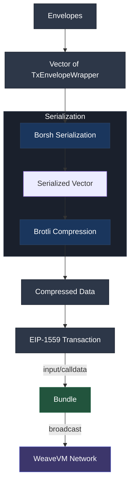
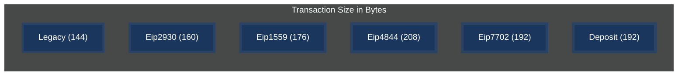

<p align="center">
  <a href="https://wvm.dev">
    
  </a>
</p>

## About

WeaveVM Bundler is a data protocol specification and library that introduces the first bundled EVM transactions format. This protocol draws inspiration from Arweave's [ANS-102](https://github.com/ArweaveTeam/arweave-standards/blob/master/ans/ANS-102.md) specification.

***Bundler as data protocol and library is still in PoC (Proof of Concept) phase - not recommended for production usage, testing purposes only.***

### Advantages of WeaveVM bundled transactions

* Reduces transaction overhead fees from multiple fees (`n`) per `n` transaction to a single fee per bundle of envelopes (`n` transactions)
* Enables third-party services to handle bundle settlement on WeaveVM
* Maximizes the TPS capacity of WeaveVM network without requiring additional protocol changes or constraints
* Supports relational data grouping by combining multiple related transactions into a single bundle

## Protocol Specification

### Nomenclature
- **Bundler**: Refers to the data protocol specification of the EVM bundled transactions on WeaveVM.
- **Envelope**: A legacy EVM transaction that serves as the fundamental building block and composition unit of a Bundle.
- **Bundle**: An EIP-1559 transaction that groups multiple envelopes (`n > 0`), enabling efficient transaction batching and processing.
- **Bundler Lib**: Refers to the Bundler Rust library that facilitates composing and propagating Bundler's bundles.

### 1. Bundle Format

A bundle is a group of envelopes organized through the following process:

1. Envelopes MUST be grouped in a vector
2. The bundle is Borsh serialized according to the `BundleData` type
3. The resulting serialization vector is compressed using Brotli compression
4. The Borsh-Brotli serialized-compressed vector is added as `input` (calldata) to an EIP-1559 transaction
5. The resulting bundle is broadcasted on WeaveVM with `target` set to `0xbabe1` address ([`0xbabe1d25501157043c7b4ea7CBC877B9B4D8A057`](https://explorer.wvm.dev/address/0xbabe1d25501157043c7b4ea7CBC877B9B4D8A057))

```rust
pub struct BundleData {
    pub envelopes: Vec<TxEnvelopeWrapper>,
}
``` 



### Bundles Versioning

Bundles versioning is based on the bundles target address:

| Bundle Version  | Bundler Target Acronym | Bundler Target Address |
| :-------------: |:-------------:| :-------------:|
| v0.1.0      | `0xbabe1`     | [0xbabe1d25501157043c7b4ea7CBC877B9B4D8A057](https://explorer.wvm.dev/address/0xbabe1d25501157043c7b4ea7CBC877B9B4D8A057)| 

### 2. Envelope Format

An envelope is a signed Legacy EVM transaction with the following MUSTs and restrictions.

```rs
pub struct EnvelopeSignature {
    pub y_parity: bool,
    pub r: String,
    pub s: String,
}

pub struct TxEnvelopeWrapper {
    pub chain_id: u64,
    pub nonce: u64,
    pub gas_price: u128,
    pub gas_limit: u64,
    pub to: String,
    pub value: String,
    pub input: String,
    pub hash: String,
    pub signature: EnvelopeSignature,
}
```

1. **Transaction Fields**
   * `nonce`: MUST be 0
   * `gas_limit`: MUST be 0
   * `gas_price`: MUST be 0
   * `value`: MUST be 0

2. **Size Restrictions**
   * Total Borsh-Brotli compressed envelopes (Bundle data) MUST be under 9 MB

3. **Signature Requirements**
   * each envelope MUST have a valid signature

4. **Usage Constraints**
   * MUST be used strictly for data settling on WeaveVM 
   * MUST only contain envelope's calldata, with optional `target` setting (default fallback to ZERO address)
   * CANNOT be used for:
     - tWVM transfers
     - Contract interactions
     - Any purpose other than data settling


### 3. Transaction Type Choice
The selection of transaction types follows clear efficiency principles. Legacy transactions were chosen for envelopes due to their minimal size (144 bytes), making them the most space-efficient option for data storage. EIP-1559 transactions were adopted for bundles as the widely accepted standard for transaction processing.



### 4. Notes
* Envelopes exist as signed Legacy transactions within bundles but operate under distinct processing rules - they are not individually processed by the WeaveVM network as transactions, despite having the structure of a Legacy transaction (signed data with a Transaction type). Instead, they are bundled together and processed as a single onchain transaction (therefore the advantage of Bundler).

* Multiple instances of the same envelope within a bundle are permissible and do not invalidate either the bundle or the envelopes themselves. These duplicate instances are treated as copies sharing the same timestamp when found in a single bundle. When appearing across different bundles, they are considered distinct instances with their respective bundle timestamps (valid envelopes and considered as copies of distinct timestamps).

* Since envelopes are implemented as signed Legacy transactions, they are strictly reserved for data settling purposes. Their use for any other purpose is explicitly prohibited for the envelope's signer security.

## Bundler Library

### Import Bundler in your project

```toml
bundler = { git = "https://github.com/weaveVM/bundler", branch = "main" }
```

### Build an envelope, build a bundle

```rust
use bundler::utils::types::{Bundle, Envelope};

// Envelope
let envelope = Envelope::new()
    .data(byte_vec)
    .target(address)
    .build()?;

// Bundle
let bundle_tx = Bundle::new()
    .private_key(private_key)
    .envelopes(envelopes)
    .build()
    .propagate()
    .await?;
```

### Example: Build a bundle packed with envelopes

```rust
async fn send_bundle_without_target() -> eyre::Result<String> {
    // will fail until a tWVM funded EOA (pk) is provided
    let private_key = String::from("");
    
    let mut envelopes: Vec<Envelope> = vec![];
    
    for _ in 0..10 {
        let random_calldata: String = generate_random_calldata(128_000); // 128 KB of random calldata
        let envelope_data = serde_json::to_vec(&random_calldata).unwrap();
        
        let envelope = Envelope::new()
            .data(Some(envelope_data))
            .target(None)
            .build()?;
            
        envelopes.push(envelope);
    }
    
    let bundle_tx = Bundle::new()
        .private_key(private_key)
        .envelopes(envelopes)
        .build()
        .propagate()
        .await?;
        
    Ok(bundle_tx)
}
```

For more examples, check the tests in [lib.rs](./src/lib.rs) and have a look over [types](./src/utils/types.rs)

## License
This project is licensed under the [MIT License](./LICENSE)